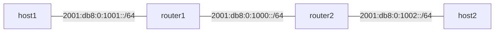

# ipv6-router



## Installation

- up docker container
  ```sh
  docker compose watch
  ```

## Usage in docker container
- setup network
  ```sh
  ./scripts/init.sh
  ```
- build
  ```sh
  make build
  ```
- run
  ```sh
  make run
  ```

## Connection check.
- enter host1
  ```sh
  ip netns exec host1 bash 
  ```
- same network
  ```sh
  ping -c 1 2001:db8:0:1001::1
  ```
- neighbor solicitation
  ```sh
  ndisc6 2001:db8:0:1001::1 host1-router1
  ```
- other network
  ```sh
  ping -c 1 2001:db8:0:1000::2
  ping -c 1 2001:db8:0:1002::2
  ```
